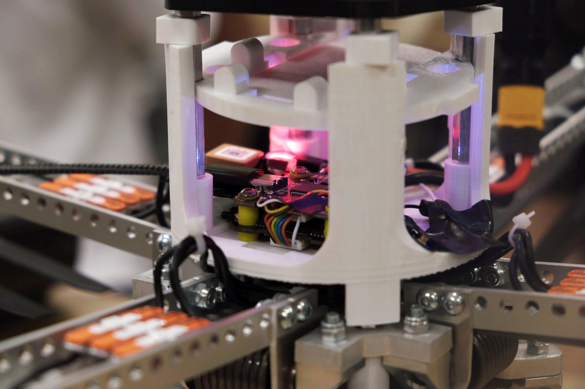
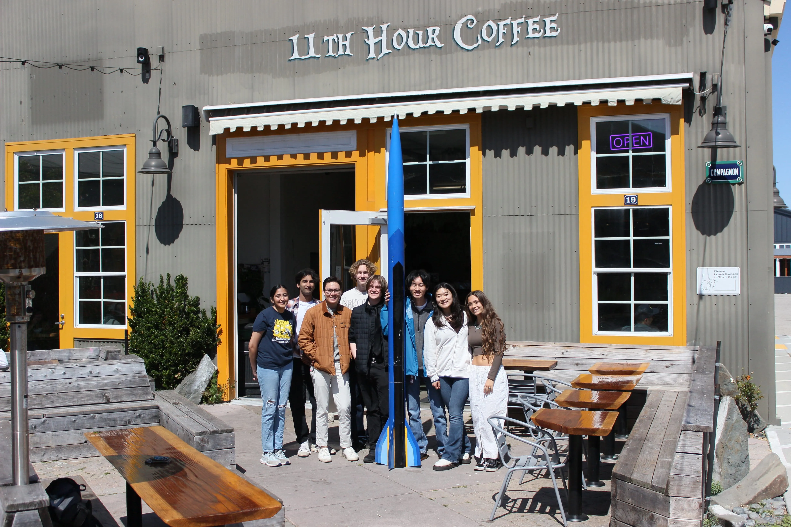

# 

    <h2>WE ARE UCSC'S PREMIER AEROSPACE ORGANIZATION</h2>
    

      Nested within the forests, the UCSC Rocket Team is the leading aerospace
      organization at the University of California, Santa Cruz. We design and
      build high-powered rockets that push bounds of performance while
      performing research missions. Rocket Team is home to a unique experience
      that enables students of any background of major to take on the biggest
      problems facing the modern areospace industry and academia. We understand
      that ingenuity can come from anywhere, and take us everywhere, so we
      embrace curiosity and persevere to build our spirit and build tomorrow.
    

    <video autoplay muted playsinline loop>
      <source src="assets/home/far-launch.mp4" type="video/mp4">
      Your browser does not support the video tag.
    </video>
  

  

    
  

  

    <h2>PUSHING LIMITS</h2>
    

      "Settle" isn't in our vocabulary. "Good enough" isn't good enough for us.
      The only competitor we have is ourselves, and we're dead set on winning.
      With every new project we break boundries, pushing ourselves higher and
      higher, soaring to new hights in search of something greater than
      ourselves. Our members take this attitude with them wherever they go,
      working tirelssly to advance the aerospace industry, and show the world
      all a slug is capable of.
    

  

  

    <h2>EMPOWERING OUR LOCAL COMMUNITY</h2>

    

      Beyond engineering excellence, we’re dedicated to sharing our passion for
      aerospace with our community. Through outreach events, workshops, and
      demonstrations, we inspire future innovators and provide students of all
      backgrounds with hands-on opportunities to explore STEM. By building
      together, we strengthen not only our team, but the community that supports
      us.
    

  

    
  

