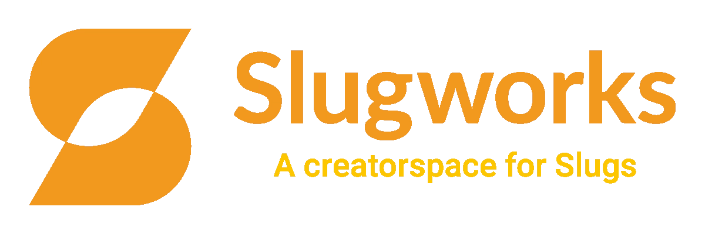
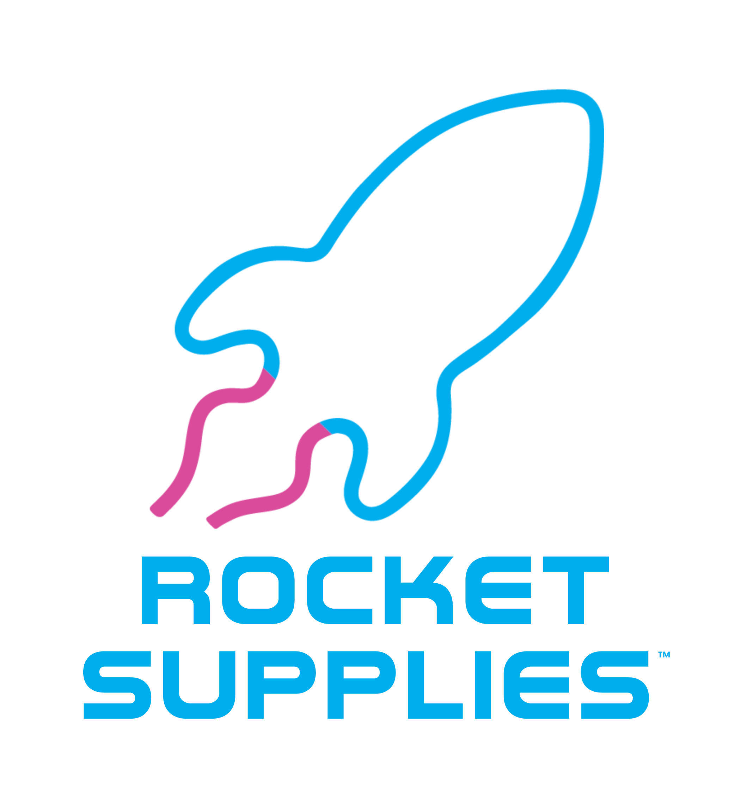
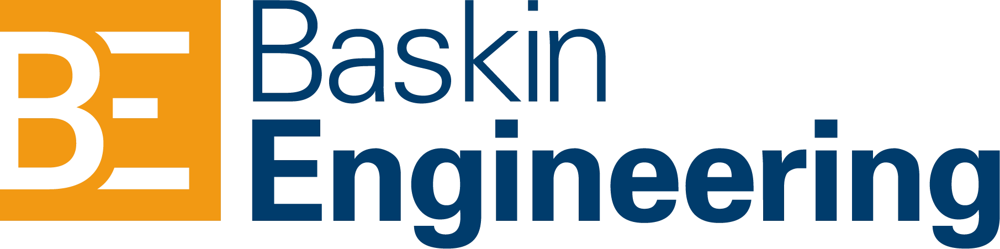
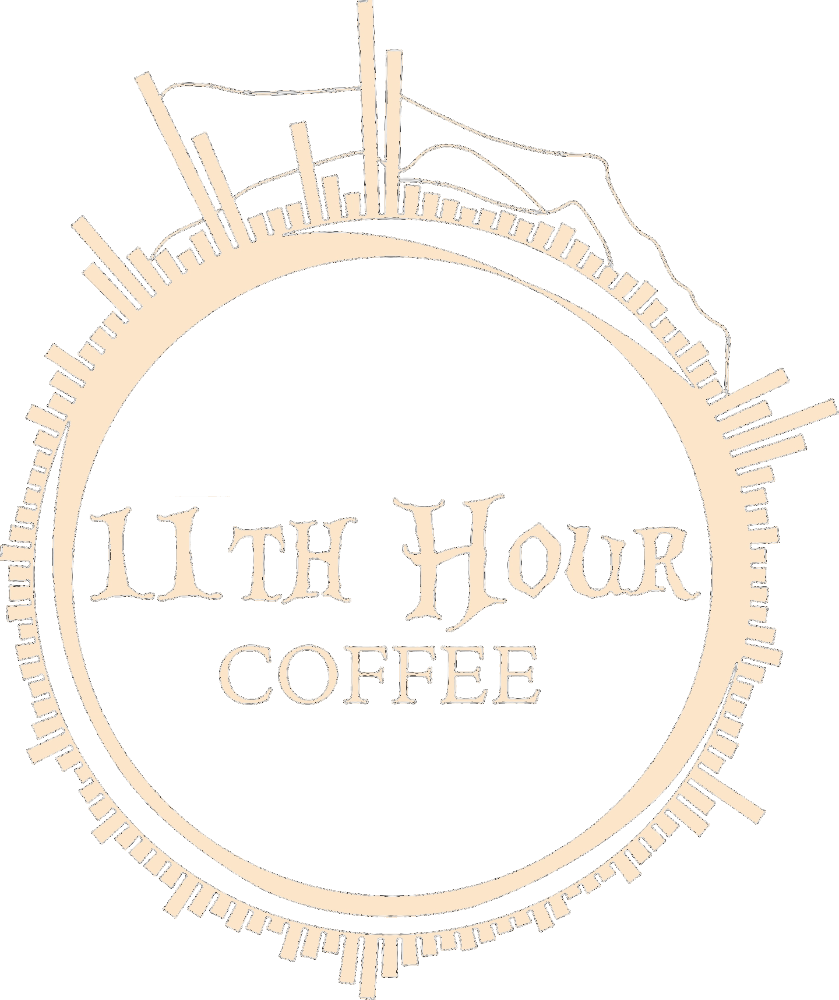
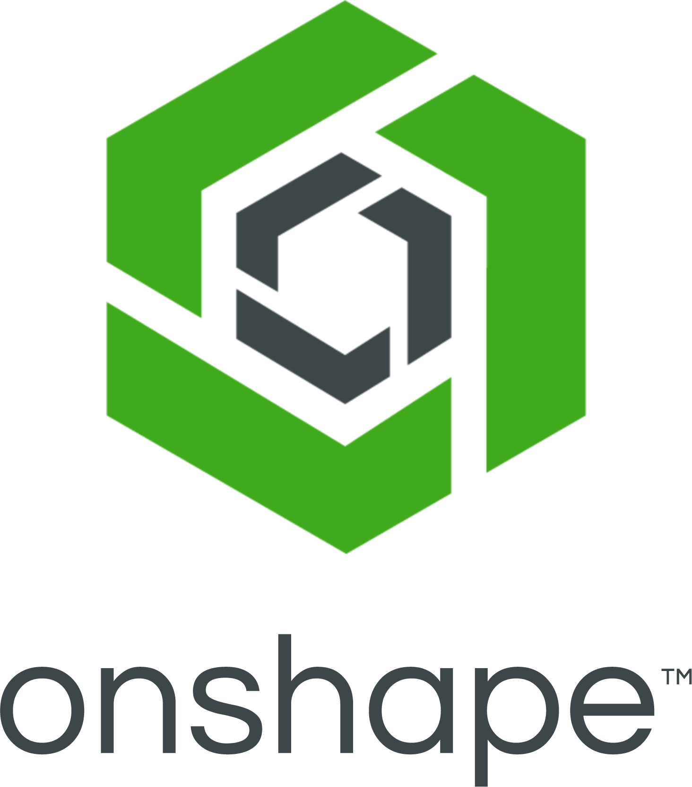
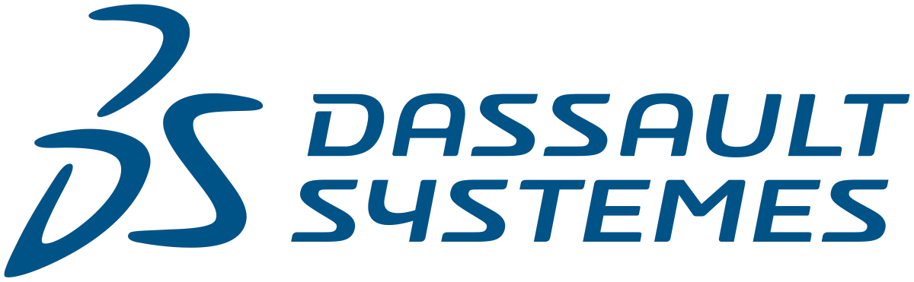

---
hide:
  - toc
  - footer
  - navigation
---

# Sponsors

The UC Santa Cruz Rocket Team extends our deepest gratitude to our sponsors for
their support. Your contributions provide the resources that allow us to design,
build, and compete at the highest level of collegiate rocketry. With your
partnership, we continue advancing engineering innovation and preparing the next
generation of aerospace leaders.

  

  
  
    
    
    
    

